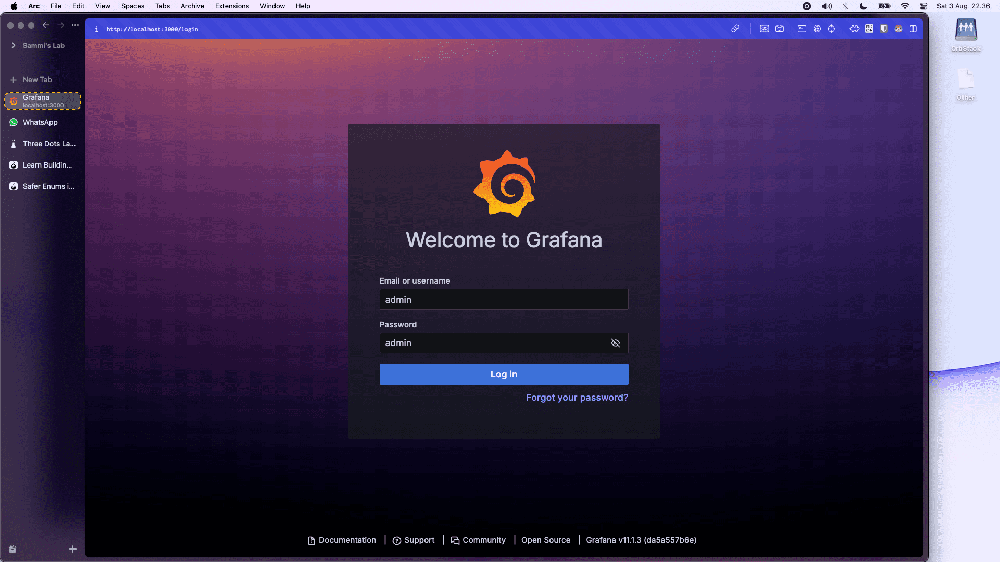
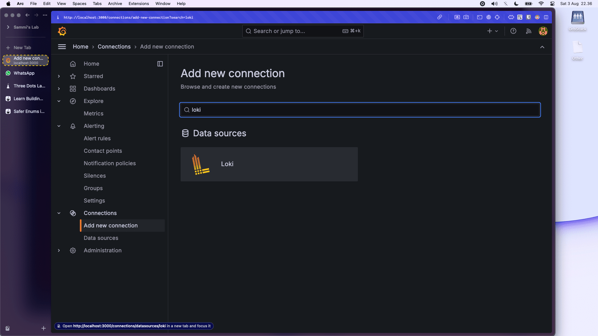
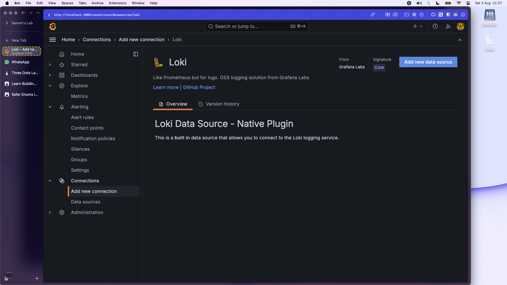
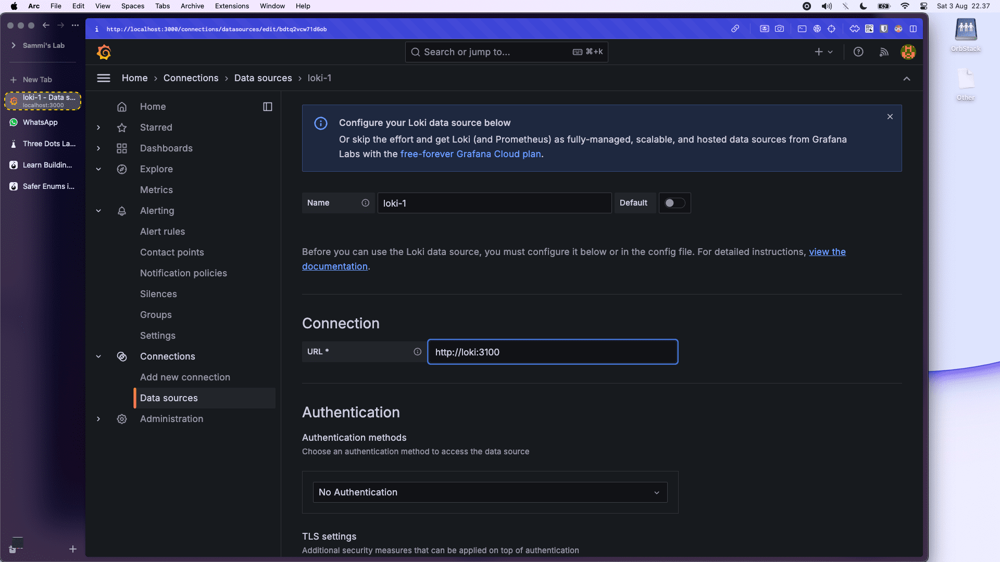
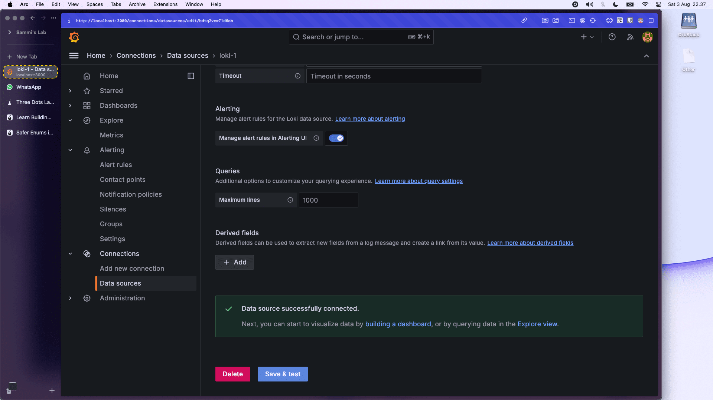
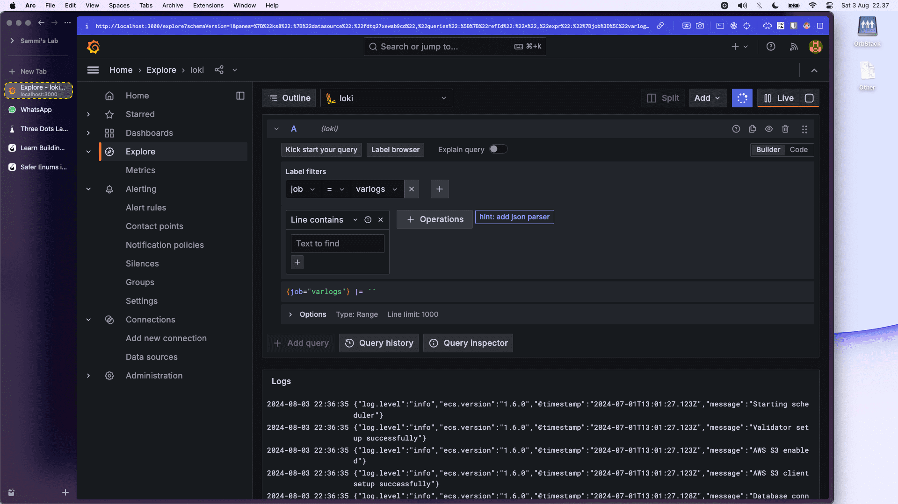

```shell
# 1. run all containers
make up
```

```shell
# 2. open grafana dashboard
http://localhost:3000
```

```shell
# 3. open "Add new connection" in the sidebar and choose "Loki"
# 4. Configure loki connection "http://loki:3100"
# 5. open "Explore" menu and select "Loki" datasource and apply the label filter "job" and "varlogs"
```







